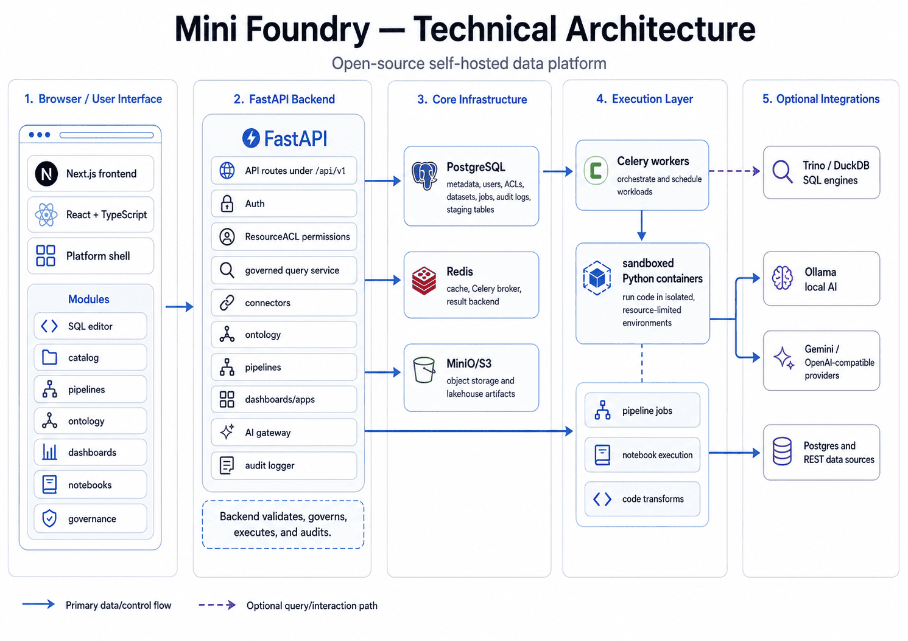

# Mini Foundry

[](LICENSE)

An open-source, **Palantir Foundry–style data platform**: connect data, govern it,
model it as an ontology, and build analytics and apps on top — end to end.

> **Status:** broad MVP, actively developed. It covers most Foundry-inspired pillars at
> MVP level but is **not yet production-ready** for sensitive/regulated data. See
> [MINI_FOUNDRY_ARCHITECTURE_REVIEW_CHECKLIST.md](MINI_FOUNDRY_ARCHITECTURE_REVIEW_CHECKLIST.md)
> for the honest gap analysis.

Screenshots and diagrams are available in [images/](images/).



---

## What works today

**Data in**
- Connectors: CSV upload, Postgres (read-only schema discovery + preview), REST API (GET + pagination + bearer/api-key)
- Data catalog: datasets, columns, profiling, row preview
- Dataset branching with three-way merge + conflict detection

**Model & transform**
- Ontology: object types, **object sets**, **functions**, and writeback/actions
- Pipelines (build graph) with execution
- Notebooks with a sandboxed execution worker (configurable Docker isolation / gVisor)
- ML models and time-series support

**Query & explore**
- Governed SQL: natural-language → SQL → backend validator (sqlglot, SELECT-only) → read-only runner
- Redis result cache keyed on (user, sql, permission_version)
- Object explorer, search/explore, dashboards & applications

**Govern**
- Unified **ResourceACL** authorization across resources (datasets, pipelines, dashboards, ML, …)
- Column masking + row-level policies
- Resource lifecycle states (draft / published / deprecated / archived)
- Pluggable **AI gateway** (Ollama local, Gemini, OpenAI-compatible) with per-dataset `ai_policy`
  enforcement (local_only / cloud_allowed / metadata_only / no_external)
- Full audit log for every data / AI / permission event

**Frontend**
- Next.js + React + TypeScript app shell over the whole platform: catalog, connectors,
  governed-SQL workspace (Monaco), ontology + object explorer, pipelines, dashboards,
  notebooks, models, governance/admin.

**Stack:** FastAPI · Postgres · Redis · Next.js/React/TypeScript · Docker · Alembic, with a backend test suite.

---

## Quick start

```bash
cp .env.example .env

# 1. Bring up the full app
docker compose up -d --build

# Optional local AI provider. This pulls the large Ollama image/model.
docker compose --profile ai up -d ollama ollama-init

# 2. Backend for local non-Docker development
cd backend
python -m venv .venv && source .venv/bin/activate
pip install --upgrade pip
pip install -r requirements.txt
alembic upgrade head
uvicorn app.main:app --reload

# 3. Frontend for local non-Docker development (new terminal)
cd frontend
cp .env.local.example .env.local
pnpm install
pnpm dev
```

Open <http://localhost:3000>, log in as `admin@mini.local` / `admin`.

The full API surface is browsable at <http://localhost:8000/docs> (OpenAPI). All routes are
under `/api/v1` and authenticated with `Authorization: Bearer <jwt>`.

---

## Smoke test

1. **Upload CSV**: `/connectors/new` → CSV tab → pick `examples/orders.csv` (any CSV works) → upload.
2. **Browse catalog**: `/catalog` → click the new dataset → see columns, profile, 50-row preview.
3. **AI SQL**: `/sql` → type *"count of rows by status"* → Generate → SQL appears in the editor → Run → results render.
4. **Validator rejects writes**: replace the SQL with `DELETE FROM staging_orders_*` → Run → 400 "forbidden SQL construct: Delete".
5. **AI policy**: upload a CSV with `ai_policy=local_only`, then run the SQL endpoint with `provider=gemini` → 403 "dataset is local_only".
6. **Ontology**: define an object type from a dataset, build an object set, and open it in the object explorer.
7. **Audit**: `/admin/audit` shows entries for `DATASET_VIEWED`, `SQL_RUN`, `AI_PROVIDER_USED`, `PERMISSION_CHANGED`, `CONNECTOR_CREATED`.

---

## Tests

```bash
cd backend
source .venv/bin/activate
pytest -q
```

Covers the SQL validator, AI policy enforcement, cache-key uniqueness, column masking,
writeback governance, sandbox isolation, the route authorization matrix, ontology
functions, and object sets. End-to-end DB/Redis paths are partly exercised manually via
the smoke test above; full E2E/load coverage is still incomplete.

---

## Layout

```
backend/app/
├── auth/         # JWT + users/roles
├── permissions/  # ResourceACL enforcement, column/row policies
├── governance/   # resource lifecycle, governed access
├── data/         # catalog, dataset models, profiling, branching
├── connectors/   # CSV / Postgres / REST + base ABC
├── ontology/     # object types, object sets, functions, writeback
├── actions/      # action execution / writeback
├── pipelines/    # build graph + execution
├── notebooks/    # sandboxed execution worker
├── ml/           # models
├── dashboards/   # dashboards + apps
├── ai/           # gateway + providers + SQL prompt builder
├── execution/    # SQL validator (sqlglot) + read-only runner
├── cache/        # Redis client + SQL/AI cache helpers
└── audit/        # event logger + admin viewer

frontend/app/
├── (auth)/       # login
├── (platform)/   # ontology, data, governance, operations, settings, …
├── catalog/      # dataset list + detail
├── connectors/   # CSV / Postgres / REST forms
├── sql/          # Monaco editor + AI chat + results
├── objects/      # object explorer
├── pipelines/ dashboards/ notebooks/ models/
└── admin/        # users + audit
```

---

## Security notes

The system has real governance primitives (ResourceACL, masking, audit, AI policies, a
sandboxed notebook worker) but is **not hardened for production**. Known areas before any
real deployment:

- Postgres connector passwords aren't yet encrypted at rest (should move to a secrets table referenced by `secret_ref`).
- The SQL runner is read-only with a per-statement timeout but currently targets the local mini_foundry DB; cross-source routing is partial.
- The frontend stores the JWT in `localStorage` — switch to httpOnly cookies before a real deployment.
- AI provider keys are read from env. Don't commit a populated `.env`. Set `JWT_SECRET` / `ENCRYPTION_KEY` for any non-local run.

See the architecture review checklist for the full list of governance, branching,
writeback, and sandboxing items still open.

---

## License

[MIT](LICENSE) © 2026 Abdullrahman Bahar
